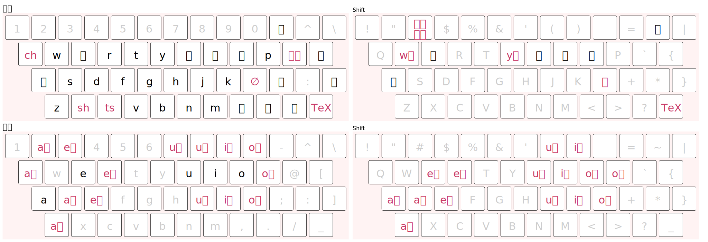

# ローマ字テーブル

## 一覧
[document.tsv](./document.tsv)

### 概観

## [AZIK](http://hp.vector.co.jp/authors/VA002116/azik/azikinfo.htm) との比較

### 利用するキー
AZIK では、小文字、`-`、`:`、`;`を用いる。

本方式では、小文字、大文字、数字、Shift+数字、`@`、`;`を用いる。

### 互換キー
小書き文字を除いて、本方式に AZIK のような互換キーはない。

### 五十音
AZIK は一般的なローマ字入力との互換性を重視しているが、本方式は各行の発音の一貫性を重視する。

ただし例外的に「を」だけは、標準的な発音は/o/だが、本方式でも`wo`で入力する。

||AZIK|本方式|本方式の補足|
|---|---|---|---|
|し|`si`|`xi`|しゃ行 (`x`)|
|すぃ|?|`si`|
|ち|`ti`|`qi`|ちゃ行 (`q`)|
|てぃ|`tgi`|`ti`|
|つ|`tu`|`cu`|つぁ行 (`c`)|
|とぅ|`tgu`|`tu`|
|じ|`ji`,`zi`|`ji`|
|ずぃ|?|`zi`|
|ぢ|`di`|`dji`|
|でぃ|`dci`|`di`|
|づ|`du`|`dcu`|
|どぅ|`dcu`|`du`|
|ふ|`hu`,`fu`|`fu`|
|を|`wo`|`wo`|
|うぉ|`wso`|`who`|

### 撥音
本方式では単体の「ん」に特別な入力方法はない。

撥音拡張は、AZIK も本方式も母音の下のキーを用いる。

||AZIK|本方式|
|---|---|---|
|ん|`nn`,`q`|`nn`,(`n`)|
|aん|`z`,(`n`)|`z`|
|iん|`k`|`k`|
|uん|`j`|`j`|
|eん|`d`|`d`|
|oん|`l`|`l`|

AZIK ではあ行の撥音拡張はないが、本方式では子音なしを表す`l`によって利用できる。

||AZIK|本方式|
|---|---|---|
|あ|`a`|`a`,`la`|
|あん|`an`|`an`,`lz`|
|いん|`in`|`in`,`lk`|
|うん|`un`|`un`,`lj`|
|えん|`en`|`en`,`ld`|
|おん|`on`|`on`,`ll`|

### 二重母音・長母音
二重母音拡張は、AZIK では母音の下方向以外の近くのキーのいずれかを、本方式では基本的に母音の上のキーを用いる (「aう」のみ例外)。

||AZIK|本方式|
|---|---|---|
|aい|`q`|`q`|
|aう||`2`|
|uう|`h`|`7`|
|eい|`w`|`3`|
|oう|`p`|`0`|

AZIK では長音符にコロンを用いることができる。本方式には単独の特別な入力方法はないが、母音と長音符の組に対する長母音拡張がある。
||AZIK|本方式|
|---|---|---|
|ー|`-`,`:`|`-`|
|aー|`a:`|`A`|
|iー|`i:`|`I`|
|uー|`u:`|`U`|
|eー|`e:`|`E`|
|oー|`o:`|`O`|

### 促音
単体の「っ」には AZIK も本方式もセミコロンを用いる。どちらも、同じ子音を2回打つことによる入力はできない。

本方式では、母音に「っ」を加えた促音拡張を、母音の右のキー (`i`,`u` は右が塞がっているので右上のキー) で入力できる。

||AZIK|本方式|
|---|---|---|
|っ|`;`,`ltu`|`;`,`Lcu`|
|aっ||`s`|
|iっ||`9`|
|uっ||`8`|
|eっ||`r`|
|oっ||`p`|

### 拗音・小書き文字
AZIK ではしゃ・ちゃ行に互換キーがある。本方式ではしゃ・ちゃ・つぁ行に中国語拼音に似た対応の専用キーがあり、逆に`y`を用いては入力できない。

||AZIK|本方式|
|---|---|---|
|しゃ|`sya`,`xa`|`xa`|
|ちゃ|`tya`,`ca`|`qa`|
|つぁ|?|`ca`|
|てゃ|?|`tya`|
|じゃ|`zya`,`ja`|`ja`|
|ぢゃ|?|`dja`|
|づぁ|?|`dca`|
|でゃ|?|`dya`|

単独で小書き文字を入力する場合、本方式ではShiftを押して大文字で入力するか、`L`に続けて入力する。
前者の場合、ぁ行では母音の拡張は利用できない。

||AZIK|本方式|本方式の補足|
|---|---|---|---|
|ぁ|`la`|`A`,`La`|
|ぁい|?|`Lq`|*~~`Q`~~ は不可|
|ぃん|?|`Lk`|ヵ行と被っているので注意|
|ヵ|?|`Ka`,`Lka`|
|ヶい|?|`K3`,`Lk3`|
|ゃ|`lya`|`Ya`,`Lya`|
|ゅう|?|`Y7`,`Ly7`|
|ゎ|`lwa`|`Wa`,`Lwa`|
|ゎん|?|`Wz`,`Lwz`|

その他
||AZIK|本方式|本方式の補足|
|---|---|---|---|
|くゎ|?|`kwa`|
|ゔぁ|`va`|`va`|
|っ|`;`,`ltu`|`;`,`Lcu`|基本的には単独で入力せず促音拡張を用いる|

### 入声拡張
AZIK には入声の第二音に使われる「き」「く」「ち」「つ」に対する拡張はない。本方式には、このうち「く」「つ」のみ入声拡張がある。
「く」はShift+撥音拡張、「つ」はShift+促音拡張で入力できる。

||AZIK|本方式|
|---|---|---|
|aく||`Z`|
|iく||`K`|
|uく||`J`|
|eく||`D`|
|oく||`L`|
|aつ||`S`|
|iつ||`)`|
|uつ||`(`|
|eつ||`R`|
|oつ||`P`|

### 特殊拡張
本方式には、AZIK のような特殊拡張は未実装。
最小限のもののみ今後実装する可能性がある。

### 記号
